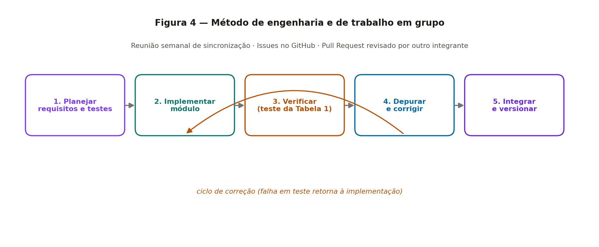

# 5. Método Experimental

## 5.1 Método de Engenharia

O desenvolvimento segue um ciclo iterativo e incremental, no qual cada módulo da
arquitetura (Seção 4) é planejado, implementado, verificado contra os testes da Tabela 1 e
integrado ao repositório. A Figura 4 ilustra o método adotado.

*Figura 4 - Método de engenharia e de trabalho em grupo*

### Etapas

1. **Planejar** — para cada módulo, identificar os requisitos da Tabela 1 que ele deve
   satisfazer e os testes correspondentes. Nenhuma implementação começa sem que o critério
   de aceitação esteja escrito.
2. **Implementar** — codificar o módulo isoladamente, respeitando as fronteiras de
   responsabilidade definidas na Seção 4.3.
3. **Verificar** — executar os testes associados ao requisito. Testes de comportamento são
   executados manualmente com roteiro fixo; testes de desempenho usam contador de FPS em
   tela.
4. **Depurar e corrigir** — em caso de falha, aplicar o procedimento de depuração descrito
   em 5.3 e retornar à etapa 2.
5. **Integrar e versionar** — abrir *Pull Request*, obter revisão de outro integrante e
   registrar a mudança no `CHANGELOG.md`.

### Ferramentas

| Finalidade | Ferramenta |
|------------|-----------|
| Controle de versão e colaboração | Git e GitHub (branches, Issues, Pull Requests, Releases) |
| Documentação | Markdown no repositório, compilado em PDF para entrega no Moodle |
| Desenvolvimento | Editor de código com suporte a depurador integrado |
| Verificação de desempenho | Contador de FPS embutido no próprio jogo (modo de depuração) |
| Registro de evidências | Capturas de tela e gravações da execução do jogo |

## 5.2 Estratégia de Verificação

A verificação é organizada em três níveis, do menor para o maior escopo:

- **Verificação de módulo** — cada módulo é exercitado isoladamente assim que concluído
  (ex.: o Módulo de Perguntas é testado com um banco reduzido, antes de existir cenário).
- **Verificação de integração** — testa as transições entre estados, especialmente o par
  crítico CENÁRIO ↔ PERGUNTAS descrito na Figura 3.
- **Verificação de sistema** — partida completa do menu até vitória ou derrota, percorrendo
  os três portais, usada para validar os requisitos RF13, RF14 e os não-funcionais.

Cada execução de teste preenche uma linha da Tabela 1 (colunas *Resultado Obtido* e
*Evidências de Resultados*), de modo que a tabela funciona simultaneamente como
especificação e como registro de verificação.

## 5.3 Identificação de Problemas e Depuração

Diante de uma falha, o grupo adota o seguinte procedimento:

1. **Reproduzir** — determinar a sequência mínima de ações que provoca a falha e registrá-la
   como Issue no GitHub.
2. **Isolar** — identificar em qual módulo da Figura 1 a falha se manifesta, usando o
   diagrama para delimitar as fronteiras suspeitas.
3. **Instrumentar** — inserir registros em tela ou em console para os valores críticos
   (posição do personagem, estado ativo, contagem de vidas, índice da questão sorteada).
4. **Corrigir e reverificar** — aplicar a correção e reexecutar não apenas o teste que
   falhou, mas todos os testes do módulo afetado, evitando regressões.

Falhas antecipadas como prováveis, dado o desenho do sistema, são: detecção de colisão
imprecisa nas bordas dos sprites; disparo repetido do mesmo portal em quadros consecutivos;
e perda de vida indevida por entrada de teclado registrada duas vezes na tela de perguntas
(coberta pelo teste de **RNF07**).

## 5.4 Método de Trabalho em Grupo

- **Divisão por módulo** — a arquitetura em blocos da Figura 1 define naturalmente as
  frentes de trabalho, permitindo desenvolvimento paralelo com baixo acoplamento e poucos
  conflitos de merge.
- **Reunião semanal de sincronização** — revisão do que foi concluído, do que está
  bloqueado e replanejamento das tarefas da semana seguinte.
- **Issues no GitHub** — cada tarefa e cada falha vira uma Issue, vinculada ao requisito
  correspondente da Tabela 1, garantindo rastreabilidade entre requisito, código e teste.
- **Revisão cruzada** — nenhum Pull Request é integrado sem revisão de um integrante que
  não escreveu o código, o que difunde o conhecimento do sistema por todo o grupo.
- **Versionamento semântico** — cada entrega semanal gera uma Release no GitHub, com o
  `CHANGELOG.md` atualizado.
